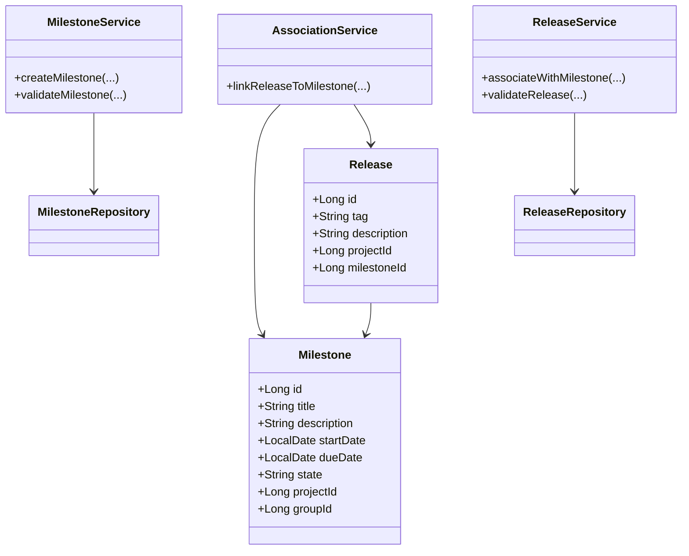
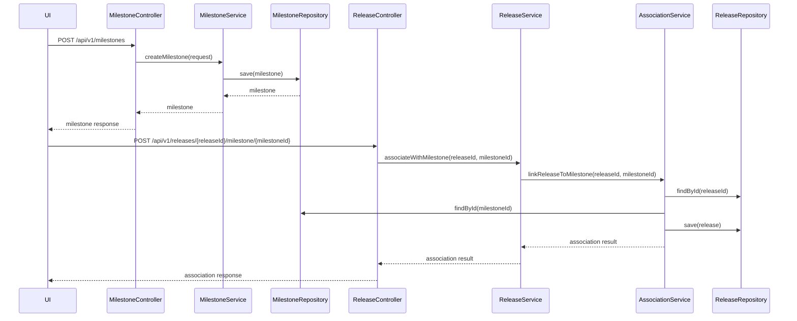
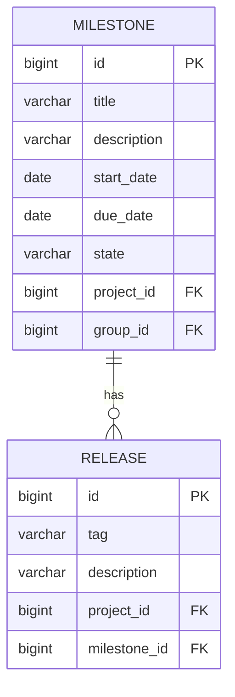

# Low-Level Design (LLD) Document: Milestone Creation and Release Association

## 1. Objective
This document details the low-level design for two user stories: (1) Creating a milestone within a project or group, and (2) Associating a release with a milestone in the GitLab application server. The design ensures milestones can be uniquely created with all required fields and that releases can be atomically associated with milestones. The solution is production-ready, supports PostgreSQL, and follows Spring Boot best practices, ensuring high concurrency and data integrity.

## 2. API Model
### 2.1 Common Components/Services
- **MilestoneService**: Handles milestone creation, validation, and state management.
- **ReleaseService**: Manages release creation and association with milestones.
- **MilestoneRepository**: Data access for milestones.
- **ReleaseRepository**: Data access for releases.
- **AssociationService**: Handles linking releases to milestones.
- **ValidationUtil**: Utility for common validation logic.

### 2.2 API Details
| Operation                        | REST Method | Type     | URL                                 | Request JSON                                                                                     | Response JSON                                                                                      |
|----------------------------------|-------------|----------|-------------------------------------|--------------------------------------------------------------------------------------------------|----------------------------------------------------------------------------------------------------|
| Create Milestone                 | POST        | Success  | /api/v1/milestones                  | {"title": "string", "description": "string", "startDate": "yyyy-MM-dd", "dueDate": "yyyy-MM-dd", "projectId": "long", "groupId": "long"} | {"id": "long", "title": "string", "description": "string", "startDate": "yyyy-MM-dd", "dueDate": "yyyy-MM-dd", "state": "active"} |
| Create Milestone                 | POST        | Failure  | /api/v1/milestones                  | { ... }                                                                                          | {"error": "Milestone title must be unique within project/group"}                                 |
| Associate Release with Milestone | POST        | Success  | /api/v1/releases/{releaseId}/milestone/{milestoneId} | N/A                                                                                              | {"releaseId": "long", "milestoneId": "long", "status": "associated"}                        |
| Associate Release with Milestone | POST        | Failure  | /api/v1/releases/{releaseId}/milestone/{milestoneId} | N/A                                                                                              | {"error": "Release tag must be unique within project"}                                           |

### 2.3 Exceptions
- **DuplicateMilestoneTitleException**: Thrown when a milestone title is not unique within the project/group.
- **InvalidDateRangeException**: Thrown when start date is after due date.
- **ReleaseTagNotUniqueException**: Thrown when a release tag is not unique within the project.
- **ReleaseAlreadyAssociatedException**: Thrown when a release is already associated with a milestone.
- **MilestoneNotFoundException**: Thrown when the milestone does not exist.
- **ReleaseNotFoundException**: Thrown when the release does not exist.

## 3. Functional Design
### 3.1 Class Diagram

### 3.2 UML Sequence Diagram

### 3.3 Components
| Component Name      | Purpose                                            | New/Existing |
|--------------------|----------------------------------------------------|--------------|
| MilestoneService   | Business logic for milestone creation/validation    | New          |
| ReleaseService     | Business logic for release association              | New          |
| MilestoneRepository| Data access for milestones                         | New          |
| ReleaseRepository  | Data access for releases                           | New          |
| AssociationService | Handles linking releases to milestones              | New          |
| ValidationUtil     | Common validation logic                            | New          |

### 3.4 Service Layer Logic and Validations
| FieldName         | Validation                                         | ErrorMessage                                      | ClassUsed           |
|-------------------|----------------------------------------------------|---------------------------------------------------|---------------------|
| title             | Unique within project/group                        | Milestone title must be unique within project/group| MilestoneService    |
| startDate, dueDate| startDate <= dueDate                               | Start date must be before or equal to due date     | MilestoneService    |
| tag               | Unique within project                              | Release tag must be unique within project          | ReleaseService      |
| releaseId         | Not already associated with a milestone            | Release already associated with a milestone        | AssociationService  |

## 4. Integrations
| SystemToBeIntegrated | IntegratedFor                | IntegrationType |
|----------------------|------------------------------|-----------------|
| PostgreSQL           | Data persistence             | DB              |
| GitLab UI            | User interaction             | API             |
| RESTful API          | External/internal consumers  | API             |
| GraphQL API          | External/internal consumers  | API             |

## 5. DB Details
### 5.1 ER Model

### 5.2 DB Validations
- **Milestone.title**: Unique constraint within (project_id, group_id)
- **Milestone.start_date <= Milestone.due_date**: Enforced at service layer, can be enforced with a check constraint if supported
- **Release.tag**: Unique constraint within project_id
- **Release.milestone_id**: Nullable, but if set, must reference a valid milestone
- **Release.milestone_id**: One-to-one association per release (enforced at service layer)

## 6. Dependencies
- PostgreSQL database
- Spring Boot framework
- GitLab application server modules for project, group, and release management
- REST and GraphQL API modules

## 7. Assumptions
- Milestone can belong to either a project or a group, not both simultaneously
- Release can only be associated with one milestone at a time
- All date fields are in ISO 8601 format (yyyy-MM-dd)
- User authentication and authorization are handled outside the scope of these APIs
- Concurrency is handled via database-level constraints and transactional service methods
- All APIs are secured and validated at the controller and service layers
